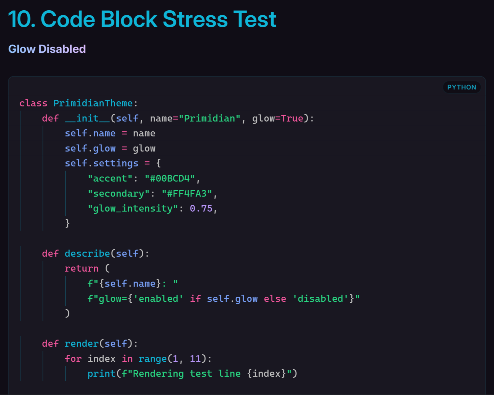
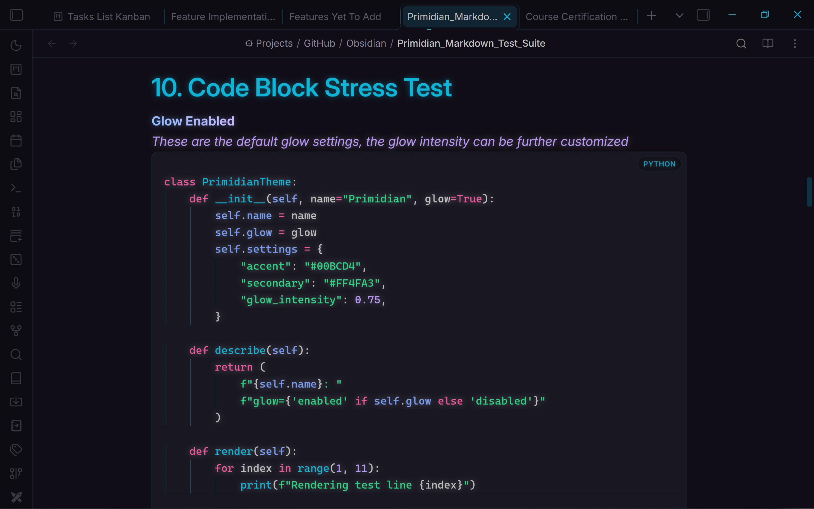

<!-- LOGO PLACEHOLDER -->

<p align="center">
  
</p>

# Primidian

**Obsidianite's visual identity, engineered.**

Primidian is a dark-first [Obsidian](https://obsidian.md/) theme built on the visual language of [Obsidianite](https://github.com/bennyxguo/Obsidian-Obsidianite) — deep violet-black surfaces, cyan and magenta accents, gradient headings, sweeping links — rebuilt from the ground up on a modern, fully tokenised architecture. It layers in what its inspiration never had: a real, deliberately designed light mode, ~240 Style Settings controls, an experimental multi-engine glow system, a coherent animation language, and root-cause fixes for two long-standing Obsidianite rendering bugs.

  

<!-- SCREENSHOT: Primidian overview → assets/screenshots/overview.png -->


---

## ✨ Features

### 🎨 Appearance & Theming

- **Dark and Light mode**, each with an independently designed palette — not an inverted copy of the other
- **Accent & colour customization** — one accent re-tints most of the theme; backgrounds, text, borders and syntax colours are all individually adjustable per mode
- **UI colour customization** — radii, icon opacity, status bar styling, scrollbars and border widths
- **Style Settings integration** — nearly every visible value is customisable

### ✍️ Typography

- **Font controls** — separate fonts for text, interface and code (no fonts bundled; install your own and set them here)
- **Size & weight controls** — base font size, body weight, line height and content width
- **Heading controls** — per-level colour, size, weight, letter spacing and text transform

### 📝 Editor & Markdown

- **Five heading styles** — Obsidianite gradient underline, Minimal, Gradient, Bordered, Accent Bar
- **Five divider styles** — Decorative, Gradient, Standard, Minimal and Animated (a travelling highlight), each distinct in *shape*, not just colour, plus a Solid/Dashed/Dotted line-pattern axis
- **Blockquote presets** — Simple, Boxy, Minimal and Fade
- **Sweeping links** — the Obsidianite-style underline that grows to fill on hover, with full geometry control
- **Custom task states** — `[/]` `[-]` `[>]` `[<]` `[?]` `[!]` `[*]`, each with its own colour and glyph
- **Unified syntax highlighting** — one palette drives both Live Preview and Reading Mode
- **Code blocks** — styling, 8 syntax colours, and optional line numbers (Live Preview)
- **Callouts, tables, embeds and properties** — all styled; Obsidianite had none of these


### ⚙️ Interface Customization

- **Sidebar, tabs, buttons, explorer, modals and controls** — custom colours, radii and hover behaviour
- **Floating or docked status bar**
- **Task List Kanban compatibility** — checkboxes render correctly where Obsidianite failed

---

## ⚙️ Customization

> ### **Primidian is designed to be highly customisable through the Style Settings plugin.**
>
> **Install the Style Settings community plugin before attempting to customise Primidian.**

1. Open Obsidian → **Settings → Community Plugins**
2. Search for **Style Settings**
3. **Install** and **enable** it
4. Open **Settings → Style Settings**
5. Select **Primidian**
6. Customise any of the ~240 available settings

Every setting has a documented default and a one-click **Restore default** button (the circular arrow). Use **Export / Import** at the top of the panel to save and restore your whole configuration.

> Without Style Settings, Primidian simply runs on its carefully chosen defaults.

<!-- SCREENSHOT: Style Settings customization → assets/screenshots/style-settings.png -->


---

## ✅ Defaults

### Enabled by default

- Dark and Light mode
- Obsidianite heading style and Decorative divider style (the signature look)
- Gradient system (bold text, headings and dividers)
- Full animation & motion system, respecting your OS reduce-motion setting
- Floating status bar

### Disabled by default

- **Glow System** — off until you enable it (see below)
- **Code block line numbers** — optional, Live Preview only
- Individual glow targets for body text, tables, blockquote borders and line numbers
- Glow **Pulse Animation**

---

## ✨ Glow System

> **Experimental — disabled by default**

Primidian includes an experimental multi-engine glow system. Enable it under **Settings → Style Settings → Primidian → Glow System**, then choose an engine:

| Engine | Technique | Best for |
|---|---|---|
| **Automatic / Dynamic** *(default)* | Per-target method selection | Intelligently picks the best technique for each element |
| **Text Shadow** | `text-shadow` | Text — headings, links, tags, highlights, code |
| **Drop Shadow** | `filter: drop-shadow()` | Icons, SVGs and UI controls — follows rendered shapes |

Each element glows with **its own configured colour**, so recolouring a divider, heading or custom task state recolours its glow automatically — no extra settings.

- **16 content targets** — headings, links, tags, highlights, dividers, buttons, checkboxes, toggles, sliders, inputs, tabs, sidebar and more, each with an independent on/off toggle
- **UI glow** — document title, search, sidebar, tabs, buttons and controls, with separate strength tiers for idle, hover and selected states
- **Global controls** — intensity, blur radius, opacity, spread and corner radius
- **Pulse animation** — optional, off by default

**Performance & accessibility notes:** glow is suppressed entirely in Windows High Contrast mode, the pulse animation respects reduce-motion, and very high intensities reduce effective contrast — the default keeps it subtle.

<!-- SCREENSHOT: Glow system → assets/screenshots/glow-system.png -->

<p align="center">
  <table align="center" style="border: none;">
    <tr>
      <td align="center" style="border: none; padding: 10px;">
        
        <br>
        <b>Glow Disabled</b>
      </td>
      <td align="center" style="border: none; padding: 10px;">
        
        <br>
        <b>Glow Enabled</b>
      </td>
    </tr>
  </table>
</p>

---

## 📝 Blockquote Presets

Selectable from **Settings → Style Settings → Primidian → Blockquotes → Blockquote Preset**. Each preset differs in *structure*, not just colour, so they stay distinguishable even with identical colours.

| Preset | Description |
|---|---|
| **Simple** | Clean, minimal left accent line |
| **Boxy** | Four-sided rectangular border with an accent line |
| **Minimal** | Left accent line with a fading top line |
| **Fade** *(default)* | Left accent line with fading top and bottom lines |

_**NOTE:** As of now, the glow system renders differently in Edit and Reading Modes. This inconsistency is most noticeable in Fade and Boxy presets. They might not look unpleasant, but their iteration of Reading mode is the more preferable and intended look._
<!-- SCREENSHOT: Blockquote presets → assets/screenshots/blockquotes.png -->

---

## 📦 Installation

1. Download `theme.css` and `manifest.json` from this repository.
2. Create a `Primidian` folder inside `<your vault>/.obsidian/themes/` and place both files there.
   > Tip: In Obsidian, go to **Settings → Appearance → Themes → Manage** and use the *Open themes folder* button to find the right location.
3. Go to **Settings → Appearance → Themes** and select **Primidian**.

### Recommended companions

- **[Style Settings](https://github.com/mgmeyers/obsidian-style-settings)** — required for customisation (see above).
- **Fonts** — Primidian bundles none. Install *Rubik*, *Inter*, *JetBrains Mono* or *Cascadia Code* and set them under **Typography**. The theme degrades gracefully to system fonts.

---

### ✨ Animations & Effects

Primidian treats animation as part of the interface design rather than as decoration. Motion is used to communicate state, hierarchy, and interaction — making elements feel responsive without overwhelming the workspace.

The animation philosophy is inspired in part by community themes such as **[Primary](https://github.com/primary-theme/obsidian)**, whose playful, deliberate approach to interface motion helped shape the direction of Primidian. **Primidian does not directly reuse Primary's animation implementation.** Its animations are independently recreated from the underlying concepts of CSS transitions, keyframes, transforms, easing, and timing, then adapted to Primidian's own design system and component structure.

This allows Primidian to build upon ideas from the Obsidian theme community while developing its own motion language, with room for further experimentation and refinement.

* **A named motion system** — four durations and easing curves, retimed globally with a single speed multiplier
* **Polished tab motion** — hover lift, press sink, raised active card, and centre-wipe indicators
* **Global gradient system** — set two colours once and every gradient follows, with per-component overrides and a master off-switch
* **Experimental glow system** — optional and disabled by default
* **Full `prefers-reduced-motion` support** — respected by default, with granular per-feature controls
* **Growing animation library** — additional interactions and motion patterns inspired by Primary and other community themes will be independently recreated and refined over time


> **Credits & inspiration:** Primidian would not exist in its current form without the ideas and experimentation shared by the Obsidian community. Primary in particular has been an important source of inspiration for Primidian's approach to playful, purposeful motion, while Obsidianite has been the reference for its design philosophy. All Primidian implementations are developed independently rather than copied directly from those themes.

## 🗺️ Roadmap

Primidian is actively evolving. The authoritative, detailed feature implementation roadmap — including planned features, task organisation, difficulty and implementation considerations — is maintained in:

**[📄 Feature Implementation Index](docs/plans/primary-feature-analysis/11-Feature-Implementation-Index.md)**

Major upcoming feature groups:

- **Style Settings reorganization** — regrouping the panel into Editor & Markdown / Interface / Typography
- **Typography depth** — font feature settings, per-heading font families, font size & weight tiers, bold modifier
- **Editor & content** — background patterns, active-line highlighting, per-heading alignment and line height, highlight combinations
- **Interface chrome** — status bar slide-out, ribbon slide-out, file-header hover-reveal, per-side embed borders
- **Major features** — progress bar customisation, simplified folder colours, additional task types
- **Experimental** — Graph view colours, Canvas colours, per-heading borders and backgrounds

---

## 📁 Project Structure

```text
src/           → Modular theme source files
docs/          → Development documentation and research
theme.css      → Generated distributable theme (build output)
build.mjs      → Build + validation system
manifest.json  → Obsidian theme metadata
LICENSE        → MIT License
```

> **`theme.css` is generated.** It is built from the modular `src/` sources — never hand-edit it. Developers edit `src/` and run `npm run build`.

---

## 🧠 Technical Overview

- **Four-tier token architecture** — raw colour ramps → semantic tokens → component tokens → Obsidian's own variables. By assigning Obsidian's variables from Primidian's tokens, native surfaces and third-party plugins are styled automatically.
- **Zero functional `!important`** — every themeable value is a CSS custom property that Style Settings can override. If you can see it, you can change it.
- **Compositor-friendly motion** — only `transform`, `opacity`, `color` and related properties animate; `transition: all` is banned.
- **Root-cause fixes** — the Task List Kanban checkbox and Reading Mode inline-code bugs are fixed architecturally, so the fixes also cover Dataview, Canvas, hover previews and embeds.

The full engineering record lives in `docs/`.

---

## 🙏 Credits & Inspiration

Primidian is inspired by several existing Obsidian themes. Their visual ideas and customisation approaches helped influence its direction.

### Obsidianite — visual foundation

**[Obsidianite](https://github.com/bennyxguo/Obsidian-Obsidianite)** by **Benny Guo** · **MIT License**

Primidian's visual identity is derived from Obsidianite — the palette, gradient headings, `§` divider, sweeping links and layered blockquotes. Portions of the visual design and CSS are adapted from Obsidianite under the terms of the MIT License; its copyright notice is retained in `LICENSE`.

### Primary — design inspiration

**[Primary](https://github.com/primary-theme/obsidian)** by **Cecilia May** · **GNU GPL v3** — ☕ [Support her on Ko-fi](https://ko-fi.com/ceciliamay)

Primidian's token architecture, animation system and customisation approach were **inspired by** Primary, the quality benchmark for interaction design in the Obsidian ecosystem.

> **No code from Primary is included in Primidian.** Primary is GPLv3; Primidian is MIT. Every Primary-inspired feature was independently reimplemented from an understanding of the underlying techniques — the same motion vocabulary, authored with Primidian's own tokens, values and selectors.

### Style Settings

**[Style Settings](https://github.com/mgmeyers/obsidian-style-settings)** by **mgmeyers** · **MIT License** — no plugin code is included; Primidian only authors a configuration the plugin reads.

### Task List Kanban

**[Task List Kanban](https://github.com/erikars/task-list-kanban)** by **Chris Kerr & Erika Rice Scherpelz** — referenced for compatibility analysis only; no code is included.

---

## 📄 License

**MIT** — see [`LICENSE`](LICENSE).
